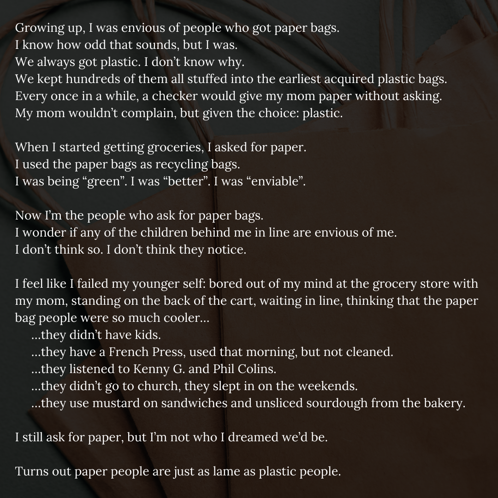
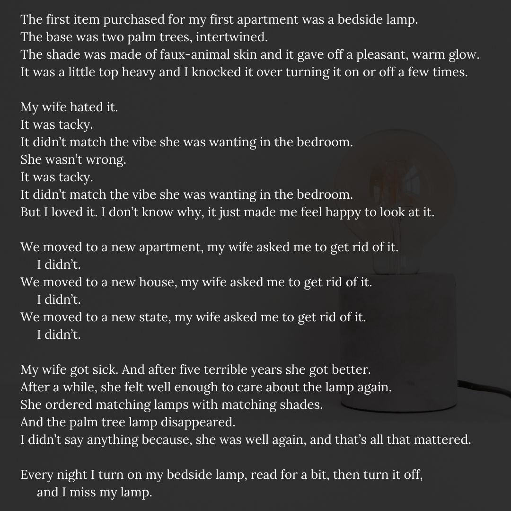

My wonderful friend Petra, half of the amazing [Adrastus Root](https://www.adrastusrood.com) author of the actually fantastic [Manly Hero](https://www.adrastusrood.com/books) (no seriously, not because they are friends, this book is stellar) posted a poetry challenege for the month of February (you can follow along here: [#februarypoetryadventure](https://www.instagram.com/explore/tags/februarypoetryadventure/)). I am not a poet, actually, don't tell anyone, but I don't really like poetry. That's not really fair, I have an appreciation for it, but I'm not intellectual enough to "get" most poetry. I tend to be much more literal, direct, and simple in my entertainment and emotional enjoyment. But, for whatever reason, whimsy took me, and I wrote a poem for the first prompt. And I enjoyed it!

I've kept going, writing a poem for each prompt as Petra doles them out, and I'm finding I'm looking forward to the prompt each day and seeing what weird ideas, formats, structures, and words pop out of my head. I'm actually finding that it's closer to how I think, the thoughts breathe and flow in waves and bursts. I don't know, maybe this is a new thing for me. I firmly believe that if you do: you are, so I "am" a poet, but I also think that titles and monikers need to be earned, so, for now. I write poems for a writing challege, and we'll leave "poet" for later.

I'm going to complile all of the poems here, in chronilogical order, but I may split them up in the future, but for now, here are the poems:

## The Poems
---
### Day 1 - Stone

---
### Day 2 - Tea

---
### Day 3 - Clock

---
### Day 4 - Paper Bag

---
### Day 5 - Vanilla

---
### Day 6 - Books

---
### Day 7 - Lamp

---
### Day 8 - Cedar

---
### Day 9 - Wax

---
### Day 10 - Old Shoes

---
### Day 11 - Desk

---
### Day 12 - Matches

---
### Day 13 - Couches

---

###### Header photo by Photo by <a href="https://unsplash.com/@valentinsalja?utm_source=unsplash&utm_medium=referral&utm_content=creditCopyText">Valentin Salja</a> on <a href="https://unsplash.com/s/photos/poetry?utm_source=unsplash&utm_medium=referral&utm_content=creditCopyText">Unsplash</a>